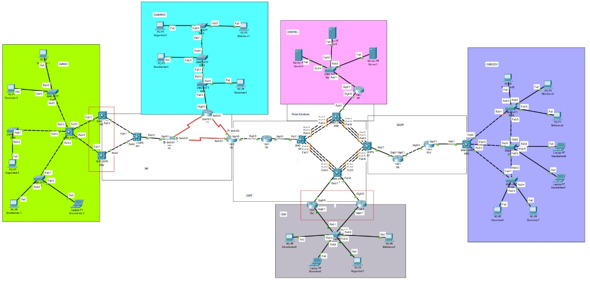
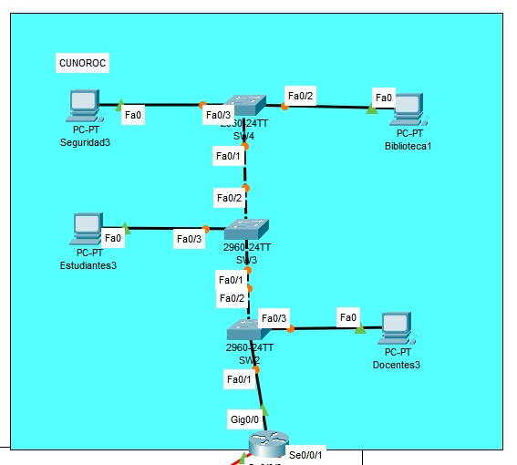
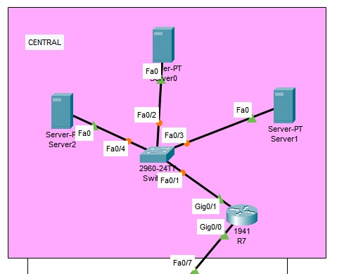
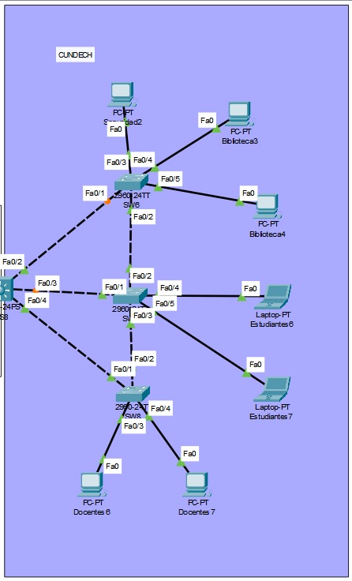
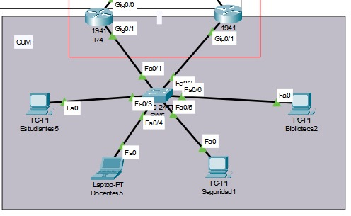
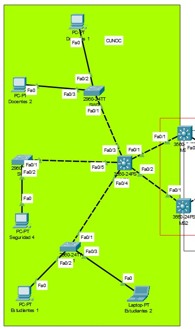
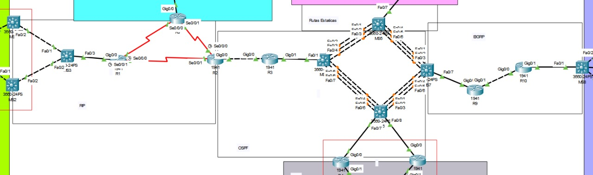

# Manual Técnico Proyecto 2

## Laboratorio Redes de Computadoras 1

### Angel Eduardo Tubac Simón 202200309

### Diego René Chen Teyul 202202882

## Resumen de Direcciones IP y VLAN

| Sede | VLAN | ID VLAN | Red base | Rango IP | Máscara | Wildcard | Hosts Necesarios | Hosts Disponibles |
| --- | --- | --- | --- | --- | --- | --- | --- | --- |
| CUNDECH | Estudiantes | 11 | 192.168.11.0/24 | 192.168.11.128/26 | 255.255.255.192 | 0.0.0.63 | 50 | 62 |
| CUNDECH | Docentes | 21 | 192.168.11.0/24 | 192.168.11.192/27 | 255.255.255.224 | 0.0.0.31 | 20 | 30 |
| CUNDECH | Seguridad | 31 | 192.168.11.0/24 | 192.168.11.224/29 | 255.255.255.248 | 0.0.0.7 | 5 | 6 |
| CUNDECH | Biblioteca | 41 | 192.168.11.0/24 | 192.168.11.0/25 | 255.255.255.128 | 0.0.0.127 | 100 | 126 |
| CUNOROC | Estudiantes | 11 | 192.148.11.0/24 | 192.148.11.128/26 | 255.255.255.192 | 0.0.0.63 | 45 | 62 |
| CUNOROC | Docentes | 21 | 192.148.11.0/24 | 192.148.11.192/27 | 255.255.255.224 | 0.0.0.31 | 25 | 30 |
| CUNOROC | Seguridad | 31 | 192.148.11.0/24 | 192.148.11.224/28 | 255.255.255.240 | 0.0.0.15 | 10 | 14 |
| CUNOROC | Biblioteca | 41 | 192.148.11.0/24 | 192.148.11.0/25 | 255.255.255.128 | 0.0.0.127 | 75 | 126 |
| CUNOC | Estudiantes | 11 | 172.16.11.0/24 | 172.16.11.0/25 | 255.255.255.128 | 0.0.0.127 | 60 | 126 |
| CUNOC | Docentes | 21 | 172.16.11.0/24 | 172.16.11.128/26 | 255.255.255.192 | 0.0.0.63 | 35 | 62 |
| CUNOC | Seguridad | 31 | 172.16.11.0/24 | 172.16.11.192/29 | 255.255.255.248 | 0.0.0.7 | 5 | 6 |
| CUNOC | Biblioteca | 41 | 172.16.11.0/24 | 172.16.11.200/26 | 255.255.255.192 | 0.0.0.63 | 50 | 62 |
| CUM | Estudiantes | 11 | 192.158.11.0/24 | 192.158.11.128/26 | 255.255.255.192 | 0.0.0.63 | 45 | 62 |
| CUM | Docentes | 21 | 192.158.11.0/24 | 192.158.11.192/27 | 255.255.255.224 | 0.0.0.31 | 25 | 30 |
| CUM | Seguridad | 31 | 192.158.11.0/24 | 192.158.11.224/28 | 255.255.255.240 | 0.0.0.15 | 10 | 14 |
| CUM | Biblioteca | 41 | 192.158.11.0/24 | 192.158.11.0/25 | 255.255.255.128 | 0.0.0.127 | 75 | 126 |
| CENTRAL | Server0 | 51 | 192.120.11.0/24 | 192.120.11.0/24 | 255.255.255.0 | 0.0.0.255 | 60 | 254 |
| CENTRAL | Server1 | 61 | 192.121.11.0/24 | 192.121.11.0/24 | 255.255.255.0 | 0.0.0.255 | 35 | 254 |
| CENTRAL | Server2 | 71 | 192.122.11.0/24 | 192.122.11.0/24 | 255.255.255.0 | 0.0.0.255 | 5 | 254 |
| Backbone | Enlaces | — | 10.0.0.0/24 | 10.0.0.x/30 | 255.255.255.252 | 0.0.0.3 | 2 | 2 |

---

## Justificación

Para la segmentación de red se utilizó **VLSM** con el fin de asignar rangos de IP de forma eficiente, según la cantidad de hosts necesarios por cada VLAN en cada sede.

- Las subredes con mayor cantidad de usuarios se asignaron primero para tener espacios amplios.
- Las redes de pocos dispositivos usan subredes pequeñas como /29 o /28.
- En la sede CENTRAL, cada servidor opera en una red /24 separada, usando la convención `192.12Y.11.0/24`, donde **Y es el número del servidor (5, 6, 7)**.
- El backbone usa **FLSM con subredes /30** para los enlaces punto a punto, ya que solo requieren 2 hosts por enlace.

Este enfoque permite reducir el desperdicio de direcciones IP y mantener una red ordenada, escalable y con direcciones claramente organizadas por sede y función.

## Implementación de Topología

### Topología completa


### CUNOROC


### CENTRAL


### CUNDECH


### CUM 


### CUNOC


### BACKBONE


## Detalle de todos los comandos utilizados

### MS0

```bash
enable
conf t
hostname MS0
vtp version 2
vtp mode server
vtp domain Grupo11
vtp password usac2025
vlan 11
name Estudiantes
vlan 21
name Docentes
vlan 31
name Seguridad
vlan 41
name Biblioteca
interface range fa0/1-5
switchport trunk encapsulation dot1q
switchport mode trunk
switchport trunk allowed vlan 11,21,31,41
exit
exit
wr

```

### MS1

```bash
enable
conf t
hostname MS1
no ip domain-lookup
vtp version 2
vtp mode client
vtp domain Grupo11
vtp password usac2025
interface fa0/1
switchport trunk encapsulation dot1q
switchport mode trunk
switchport trunk allowed vlan 11,21,31,41
no shutdown
exit
interface vlan 11
ip address 172.16.11.2 255.255.255.192
standby 14 ip 172.16.11.1
standby 14 priority 150
standby 14 preempt
no shutdown
exit
interface vlan 41
ip address 172.16.11.66 255.255.255.192
standby 44 ip 172.16.11.65
standby 44 priority 150
standby 44 preempt
no shutdown
exit
interface vlan 21
ip address 172.16.11.130 255.255.255.192
standby 24 ip 172.16.11.129
standby 24 priority 150
standby 24 preempt
no shutdown
exit
interface vlan 31
ip address 172.16.11.194 255.255.255.248
standby 34 ip 172.16.11.193
standby 34 priority 150
standby 34 preempt
no shutdown
exit
interface fa0/2
no switchport
ip address 10.0.0.1 255.255.255.252
no shutdown
exit
ip routing
router rip
version 2
network 172.16.11.0
network 10.0.0.0
no auto-summary
exit
end
wr

```

### MS2

```bash
enable
conf t
hostname MS2
no ip domain-lookup
vtp version 2
vtp mode client
vtp domain Grupo11
vtp password usac2025
interface fa0/2
switchport trunk encapsulation dot1q
switchport mode trunk
switchport trunk allowed vlan 11,21,31,41
no shutdown
exit
interface vlan 11
ip address 172.16.11.3 255.255.255.192
standby 14 ip 172.16.11.1
no shutdown
exit
interface vlan 41
ip address 172.16.11.67 255.255.255.192
standby 44 ip 172.16.11.65
no shutdown
exit
interface vlan 21
ip address 172.16.11.131 255.255.255.192
standby 24 ip 172.16.11.129
no shutdown
exit
interface vlan 31
ip address 172.16.11.195 255.255.255.248
standby 34 ip 172.16.11.193
no shutdown
exit
interface fa0/1
no switchport
ip address 10.0.0.5 255.255.255.252
no shutdown
exit
ip routing
router rip
version 2
network 172.16.11.0
network 10.0.0.0
no auto-summary
exit
end
wr

```

### MS3

```bash
enable
conf t
hostname MS3
no ip domain-lookup
interface fa0/2
no switchport
ip address 10.0.0.2 255.255.255.252
no shutdown
exit
interface fa0/1
no switchport
ip address 10.0.0.6 255.255.255.252
no shutdown
exit
interface fa0/3
no switchport
ip address 10.0.0.9 255.255.255.252
no shutdown
exit
ip routing
router rip
version 2
network 10.0.0.0
network 172.16.11.0
no auto-summary
exit
end
wr

```

### MS4

```bash
enable
conf t
hostname MS4
no ip domain-lookup
interface port-channel 1
no switchport
ip address 10.0.0.38 255.255.255.252
no shutdown
exit
interface range fa0/5-7
no switchport
channel-group 1 mode active
no shutdown
exit
interface port-channel 2
no switchport
ip address 10.0.0.34 255.255.255.252
no shutdown
exit
interface range fa0/2-4
no switchport
channel-group 2 mode active
no shutdown
exit
interface fa0/1
no switchport
ip address 10.0.0.29 255.255.255.252
no shutdown
exit
ip routing
router ospf 1
network 10.0.0.28 0.0.0.3 area 0
network 10.0.0.32 0.0.0.3 area 0
network 10.0.0.36 0.0.0.3 area 0
exit
end
wr

```

### MS5

```bash
enable
conf t
hostname MS5
no ip domain-lookup
interface port-channel 1
no switchport
ip address 10.0.0.54 255.255.255.252
no shutdown
exit
interface range fa0/5-7
no switchport
channel-group 1 mode active
no shutdown
exit
interface port-channel 2
no switchport
ip address 10.0.0.33 255.255.255.252
no shutdown
exit
interface range fa0/2-4
no switchport
channel-group 2 mode active
no shutdown
exit
interface fa0/1
no switchport
ip address 10.0.0.70 255.255.255.252
no shutdown
exit
ip routing
ip route 192.120.11.0 255.255.255.0 10.0.0.69
ip route 192.121.11.0 255.255.255.0 10.0.0.69
ip route 192.122.11.0 255.255.255.0 10.0.0.69
router ospf 1
network 10.0.0.32 0.0.0.3 area 0
network 10.0.0.52 0.0.0.3 area 0
network 10.0.0.68 0.0.0.3 area 0
redistribute static subnets
end
wr

```

### MS6

```bash
enable
conf t
hostname MS6
no ip domain-lookup
vtp version 2
vtp mode client
vtp domain Grupo11
vtp password usac2025
interface fa0/1
no switchport
ip address 10.0.0.42 255.255.255.252
no shutdown
exit
interface fa0/2
no switchport
ip address 10.0.0.46 255.255.255.252
no shutdown
exit
interface port-channel 1
no switchport
ip address 10.0.0.37 255.255.255.252
exit
interface range fa0/5-7
no switchport
channel-group 1 mode active
exit
interface port-channel 2
no switchport
ip address 10.0.0.49 255.255.255.252
no sh
exit
interface range fa0/3-4
no switchport
channel-group 2 mode active
no sh
exit
interface fa0/8
no switchport
channel-group 2 mode active
no sh
exit
ip routing
router ospf 1
network 192.158.11.0 0.0.0.127 area 0
network 192.158.11.128 0.0.0.63 area 0
network 192.158.11.192 0.0.0.31 area 0
network 192.158.11.224 0.0.0.15 area 0
network 10.0.0.40 0.0.0.3 area 0
network 10.0.0.44 0.0.0.3 area 0
network 10.0.0.36 0.0.0.3 area 0
network 10.0.0.48 0.0.0.3 area 0
exit
end
wr

```

### MS7

```bash
enable
conf t
hostname MS7
no ip domain-lookup
interface fa0/1
no switchport
ip address 10.0.0.57 255.255.255.252
no shutdown
exit
interface port-channel 2
no switchport
ip address 10.0.0.50 255.255.255.252
no shutdown
exit
interface range fa0/2-4
no switchport
channel-group 2 mode active
no shutdown
exit
interface port-channel 1
no switchport
ip address 10.0.0.53 255.255.255.252
no shutdown
exit
interface range fa0/5-7
no switchport
channel-group 1 mode active
no shutdown
exit
ip routing
router eigrp 10
network 10.0.0.48 0.0.0.3
network 10.0.0.52 0.0.0.3
network 10.0.0.56 0.0.0.3
redistribute ospf 1 metric 10000 100 255 1 1500
no auto-summary
exit
router ospf 1
network 10.0.0.48 0.0.0.3 area 0
network 10.0.0.52 0.0.0.3 area 0
redistribute eigrp 10 subnets
exit
end
wr

```

### MS8

```bash
enable
conf t
hostname MS8
no ip domain-lookup
vtp version 2
vtp mode client
vtp domain Grupo11
vtp password usac2025
interface range fa0/2-4
switchport trunk encapsulation dot1q
switchport mode trunk
switchport trunk allowed vlan 11,21,31,41
no shutdown
exit
interface fa0/1
no switchport
ip address 10.0.0.65 255.255.255.252
no shutdown
exit
interface vlan 41
ip address 192.168.11.1 255.255.255.128
no shutdown
interface vlan 11
ip address 192.168.11.129 255.255.255.192
no shutdown
interface vlan 21
ip address 192.168.11.193 255.255.255.224
no shutdown
interface vlan 31
ip address 192.168.11.225 255.255.255.248
no shutdown
ip routing
router eigrp 10
network 10.0.0.64 0.0.0.3
network 192.168.11.0 0.0.0.127
network 192.168.11.128 0.0.0.63
network 192.168.11.192 0.0.0.31
network 192.168.11.224 0.0.0.7
no auto-summary
end
wr

```

### R0

```bash
enable
conf t
hostname R0
no ip domain-lookup
interface gi0/1
no shutdown
exit
interface gi0/1.44
encapsulation dot1Q 44
ip address 192.148.11.1 255.255.255.128
exit
interface gi0/1.14
encapsulation dot1Q 14
ip address 192.148.11.129 255.255.255.192
exit
interface gi0/1.24
encapsulation dot1Q 24
ip address 192.148.11.193 255.255.255.224
exit
interface gi0/1.34
encapsulation dot1Q 34
ip address 192.148.11.225 255.255.255.240
exit
interface s0/1/0
ip address 10.0.0.14 255.255.255.252
no shutdown
exit
interface s0/1/1
ip address 10.0.0.21 255.255.255.252
no shutdown
exit
router rip
version 2
network 10.0.0.0
network 192.148.11.0
no auto-summary
exit
end
wr

```

### R1

```bash
enable
conf t
hostname R1
no ip domain-lookup
interface gi0/0
ip address 10.0.0.10 255.255.255.252
no shutdown
exit
interface s0/1/0
ip address 10.0.0.13 255.255.255.252
no shutdown
exit
interface s0/1/1
ip address 10.0.0.17 255.255.255.252
no shutdown
exit
router rip
version 2
network 10.0.0.0
no auto-summary
exit
end
wr

```

### R10

```bash
enable
conf t
hostname R10
no ip domain-lookup
interface gi0/0
ip address 10.0.0.66 255.255.255.252
no shutdown
exit
interface gi0/1
ip address 10.0.0.61 255.255.255.252
no shutdown
exit
router eigrp 10
network 10.0.0.60 0.0.0.3
network 10.0.0.64 0.0.0.3
no auto-summary
end
wr

```

### R2

```bash
enable
conf t
hostname R2
no ip domain-lookup
interface s0/1/0
ip address 10.0.0.22 255.255.255.252
no shutdown
exit
interface s0/1/1
ip address 10.0.0.18 255.255.255.252
no shutdown
exit
interface gi0/0
ip address 10.0.0.26 255.255.255.252
no shutdown
exit
router rip
version 2
network 10.0.0.16
network 10.0.0.20
no auto-summary
redistribute ospf 1 metric 1
exit
router ospf 1
network 10.0.0.24 0.0.0.3 area 0
redistribute rip subnets
exit
end
wr

```

### R3

```bash
enable
conf t
hostname R3
no ip domain-lookup
interface gi0/1
ip address 10.0.0.30 255.255.255.252
no shutdown
exit
interface gi0/0
ip address 10.0.0.25 255.255.255.252
no shutdown
exit
router ospf 1
network 10.0.0.24 0.0.0.3 area 0
network 10.0.0.28 0.0.0.3 area 0
exit
end
wr

```

### R4

```bash
enable
conf t
hostname R4
no ip domain-lookup
router ospf 1
no network 192.158.11.0 0.0.0.255 area 0
network 192.158.11.0 0.0.0.127 area 0
network 192.158.11.128 0.0.0.63 area 0
network 192.158.11.192 0.0.0.31 area 0
network 192.158.11.224 0.0.0.15 area 0
network 10.0.0.40 0.0.0.3 area 0
exit
interface gi0/0
no shutdown
exit
interface gi0/0.14
encapsulation dot1Q 14
ip address 192.158.11.130 255.255.255.192
standby 14 ip 192.158.11.129
standby priority 150
standby 14 priority 150
standby 14 preempt
no shutdown
exit
interface gi0/0.24
encapsulation dot1Q 24
ip address 192.158.11.194 255.255.255.224
standby 24 ip 192.158.11.193
standby priority 150
standby 24 priority 150
standby 24 preempt
no shutdown
exit
interface gi0/0.34
encapsulation dot1Q 34
ip address 192.158.11.226 255.255.255.240
standby 34 ip 192.158.11.225
standby priority 150
standby 34 priority 150
standby 34 preempt
no shutdown
exit
interface gi0/0.44
encapsulation dot1Q 44
ip address 192.158.11.2 255.255.255.128
standby 44 ip 192.158.11.1
standby priority 150
standby 44 priority 150
standby 44 preempt
no shutdown
exit
interface gi0/0
no shutdown
exit
end
wr

```

### R5

```bash
enable
conf t
hostname R5
no ip domain-lookup
interface gi0/1
ip address 10.0.0.45 255.255.255.252
no shutdown
exit
interface gi0/0.14
encapsulation dot1Q 14
ip address 192.158.11.131 255.255.255.192
standby 14 ip 192.158.11.129
exit
interface gi0/0.24
encapsulation dot1Q 24
ip address 192.158.11.195 255.255.255.224
standby 24 ip 192.158.11.193
exit
interface gi0/0.34
encapsulation dot1Q 34
ip address 192.158.11.227 255.255.255.240
standby 34 ip 192.158.11.225
exit
interface gi0/0.44
encapsulation dot1Q 44
ip address 192.158.11.3 255.255.255.128
standby 44 ip 192.158.11.1
exit
interface gi0/0
no shutdown
exit
router ospf 1
network 192.158.11.0 0.0.0.127 area 0
network 192.158.11.128 0.0.0.63 area 0
network 192.158.11.192 0.0.0.31 area 0
network 192.158.11.224 0.0.0.15 area 0
network 10.0.0.44 0.0.0.3 area 0
exit
end
wr

```

### R7

```bash
enable
conf t
hostname R7
no ip domain-lookup
interface gi0/0
ip address 10.0.0.69 255.255.255.252
no shutdown
exit
interface gi0/1
no shutdown
exit
interface gi0/1.54
encapsulation dot1Q 54
ip address 192.120.11.1 255.255.255.0
exit
interface gi0/1.64
encapsulation dot1Q 64
ip address 192.121.11.1 255.255.255.0
exit
interface gi0/1.74
encapsulation dot1Q 74
ip address 192.122.11.1 255.255.255.0
exit
ip route 0.0.0.0 0.0.0.0 10.0.0.70
ip routing
end
wr

```

### R9

```bash
enable
conf t
hostname R9
no ip domain-lookup
interface gi0/1
ip address 10.0.0.62 255.255.255.252
no shutdown
exit
interface gi0/0
ip address 10.0.0.58 255.255.255.252
no shutdown
exit
router eigrp 10
network 10.0.0.56 0.0.0.3
network 10.0.0.60 0.0.0.3
no auto-summary
end
wr

```

### SW0

```bash
enable
conf t
hostname SW0
vtp version 2
vtp mode client
vtp domain Grupo11
vtp password usac2025
interface range fa0/1-2
switchport mode access
switchport access vlan 21
exit
interface fa0/3
switchport mode trunk
switchport trunk allowed vlan 11,21,31,41
exit
exit
wr

```

### SW1

```bash
enable
conf t
hostname SW1
vtp version 2
vtp mode client
vtp domain Grupo11
vtp password usac2025
interface range fa0/1-2
switchport mode access
switchport access vlan 11
exit
interface fa0/5
switchport mode trunk
switchport trunk allowed vlan 11,21,31,41
exit
exit
wr

```

### SW2

```bash
enable
conf t
hostname SW2
vtp version 2
vtp mode client
vtp domain Grupo11
vtp password usac2025
interface fa0/1
switchport mode trunk
switchport trunk allowed vlan 11,21,31,41
exit
interface fa0/2
switchport mode trunk
switchport trunk allowed vlan 11,21,31,41
exit
interface fa0/3
switchport mode access
switchport access vlan 21
exit
exit
wr

```

### SW3

```bash
enable
conf t
hostname SW3
vtp version 2
vtp mode server
vtp domain Grupo11
vtp password usac2025
vlan 11
name Estudiantes
vlan 21
name Docentes
vlan 31
name Seguridad
vlan 41
name Biblioteca
interface range fa0/1-2
switchport mode trunk
switchport trunk allowed vlan 11,21,31,41
exit
interface fa0/3
switchport mode access
switchport access vlan 11
exit
exit
wr

```

### SW4

```bash
enable
conf t
hostname SW4
vtp version 2
vtp mode client
vtp domain Grupo11
vtp password usac2025
interface range fa0/1-2
switchport mode trunk
switchport trunk allowed vlan 11,21,31,41
exit
interface fa0/3
switchport mode access
switchport access vlan 21
exit
exit
wr

```

### SW5

```bash
enable
conf t
hostname SW5
vtp version 2
vtp mode server
vtp domain Grupo11
vtp password usac2025
vlan 11
name Estudiantes
vlan 21
name Docentes
vlan 31
name Seguridad
vlan 41
name Biblioteca
interface range fa0/1-2
switchport mode trunk
switchport trunk allowed vlan 11,21,31,41
exit
interface fa0/3
switchport mode access
switchport access vlan 11
exit
interface fa0/4
switchport mode access
switchport access vlan 21
exit
interface fa0/5
switchport mode access
switchport access vlan 31
exit
interface fa0/6
switchport mode access
switchport access vlan 41
exit
exit
wr

```

### SW6

```bash
enable
conf t
hostname SW6
vtp version 2
vtp mode client
vtp domain Grupo11
vtp password usac2025
interface fa0/1
switchport mode trunk
switchport trunk allowed vlan 11,21,31,41
exit
interface fa0/2
switchport mode trunk
switchport trunk allowed vlan 11,21,31,41
exit
interface fa0/3
switchport mode access
switchport access vlan 31
exit
interface range fa0/4-5
switchport mode access
switchport access vlan 41
exit
exit
wr

```

### SW7

```bash
enable
conf t
hostname SW7
vtp version 2
vtp mode server
vtp domain Grupo11
vtp password usac2025
vlan 11
name Estudiantes
vlan 21
name Docentes
vlan 31
name Seguridad
vlan 41
name Biblioteca
interface range fa0/1-3
switchport mode trunk
switchport trunk allowed vlan 11,21,31,41
exit
interface range fa0/4-5
switchport mode access
switchport access vlan 11
exit
exit
wr

```

### SW8

```bash
enable
conf t
hostname SW8
vtp version 2
vtp mode client
vtp domain Grupo11
vtp password usac2025
interface fa0/1
switchport mode access
switchport access vlan 21
exit
interface fa0/2
switchport mode trunk
switchport trunk allowed vlan 11,21,31,41
exit
interface fa0/3
switchport mode access
switchport access vlan 21
exit
interface fa0/4
switchport mode trunk
switchport trunk allowed vlan 11,21,31,41
exit
exit
wr

```

### SW9

```bash
enable
conf t
hostname SW9
vtp version 2
vtp mode client
vtp domain Grupo11
vtp password usac2025
interface fa0/1
switchport mode access
switchport access vlan 31
exit
interface fa0/4
switchport mode trunk
switchport trunk allowed vlan 11,21,31,41
exit
exit
wr

```

### Switch0

```bash
enable
conf t
hostname Switch0
vtp version 2
vtp mode server
vtp domain Grupo11
vtp password usac2025
vlan 51
name Server0
vlan 61
name Server1
vlan 71
name Server2
interface fa0/1
switchport mode trunk
switchport trunk allowed vlan 51,64,74
exit
interface fa0/2
switchport mode access
switchport access vlan 51
exit
interface fa0/3
switchport mode access
switchport access vlan 61
exit
interface fa0/4
switchport mode access
switchport access vlan 71
exit
exit
wr

```